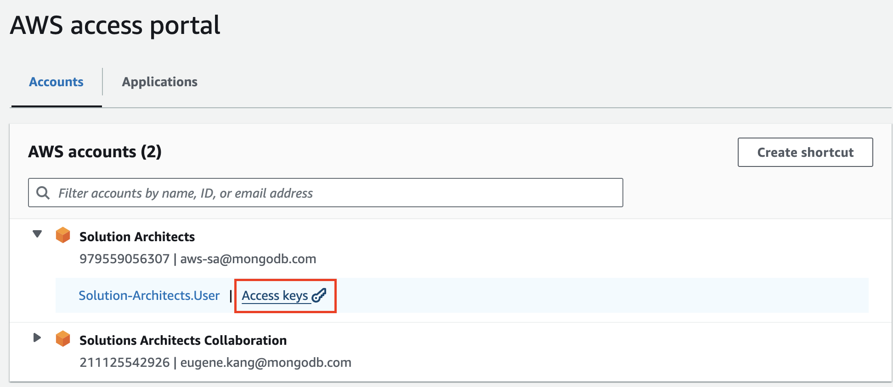
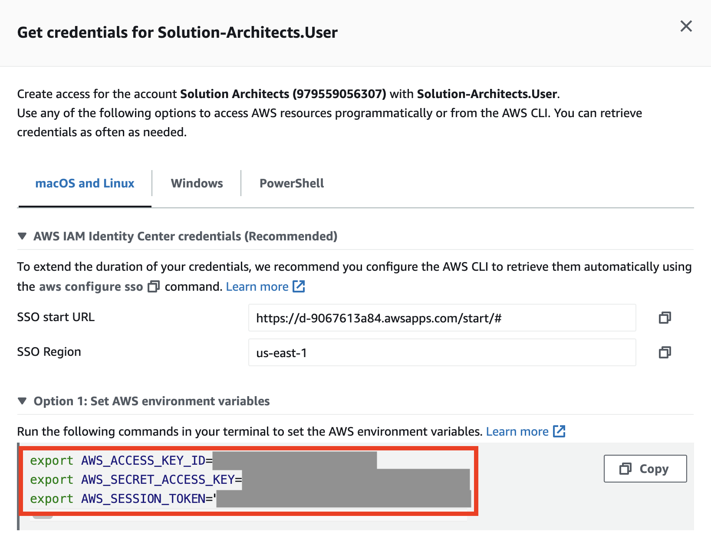
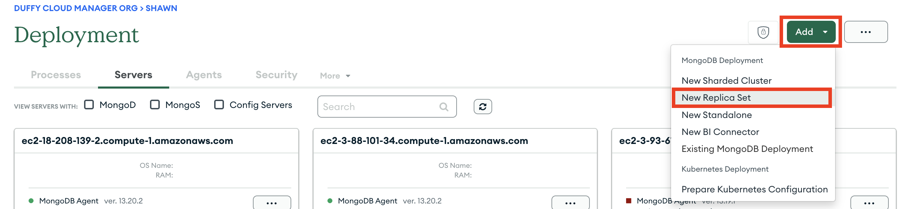
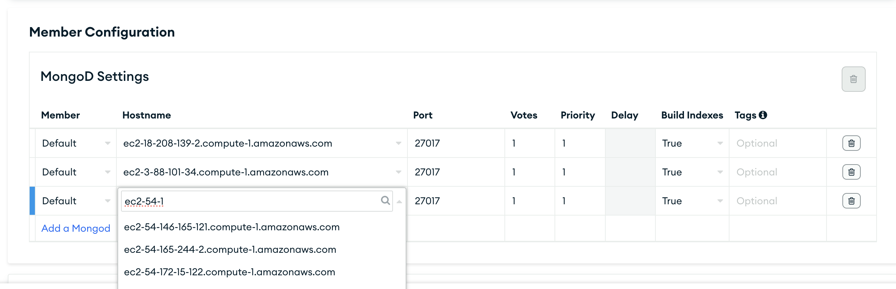

# Terraform-CM-dataNode-Launcher
## What does it do?
This set of Terraform script launches a 3 VM's from the cloud provider (default is AWS EC2), rename the server hostname to public ipv4 address, install the MongoDB automation agents which will automatically connect to the Cloud Manager group. All of this happens within 2-3 minutes.

## Before running
- Download or update terraform
- fill out `terraform.tfvars`


Terraform is required for this. If using a MacOS, use Homebrew to install.
Below are from the [Hashicorp's official documentation](https://developer.hashicorp.com/terraform/tutorials/aws-get-started/install-cli). 
```
brew update
brew tap hashicorp/tap
brew install hashicorp/tap/terraform
```
---

You also need to rename the file terraform.tfvars.example into **terraform.tfvars** then fill out your custom environment variables. There are a set of default values such as number of instances, OS image type, and instance type that you can explicitly call out and change. The default values should be good for most use cases. The access key, secret key, and the session key are from the AWS console, speficially from the AWS Solution-Architect.User (federated user) access portal. Refer to below images to grab those 3 variables.






## Running the script
Once the terraform.tfvars is ready, then just run the 3 lines below on the terminal. The -auto-approve flag skips a step that you type in "yes"
```
terraform init
terraform plan
terraform apply -auto-approve
```
Output will be listed with the hostnames like shown below.
> hostnames = {
>  "ec2-18-208-139-2.compute-1.amazonaws.com" = "running"
>  "ec2-3-88-101-34.compute-1.amazonaws.com" = "running"
>  "ec2-54-165-244-2.compute-1.amazonaws.com" = "running"
> }

If you want to see these hostnames afterwards. Use `terraform output`. You can also go to the AWS console to see and edit those info. If you are more familiar with terraform, I recommend using the same script to just change your expire-on tags.

Use the above list to add them to your Cloud Manager replica set configuration



Once you are finished you can let the AWS reaper agent automatically take care of your instances or use the below terraform code for a clean state.
```
terraform destroy
```

**_Cloud Manager does NOT automatically detect these dead AWS instances_**. It is still manual work, thus choose the "Remove from Cloud Manager" option from the Processes tab and individually find and delete the hostanames on the servers tab.


## Monitoring and data population
I've been using the [POC-Driver](https://github.com/johnlpage/POCDriver) to make the Real Time, Metrics, and Data to be populated so that it's not an empty cluster. So far I've been using my personal laptop to run the code but once this is dockerized, it may all be packaged together.

```
java -jar ./bin/POCDriver.jar --host "mongodb://{userName}:{password}@{ec2-host-name}"
```

---

# Appendix
These are extra information that are good to know but not required

## :construction: What's being automated :construction: (still being worked on)

After the above scripts the following will happen 
1. Creates the number of EC2
2. Hostname changed to the public IPv4 DNS
3. MongoDB Automation Agent downloaded to the EC2 instances
4. Cloud Manager shows the EC2's with the reachable hostnames
5. Use any desired performance test scripts such as mLocust or POC-Driver to mock up


